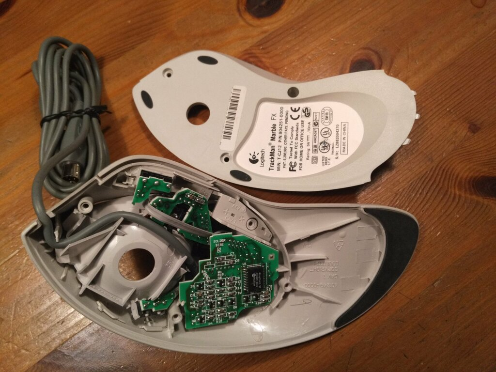
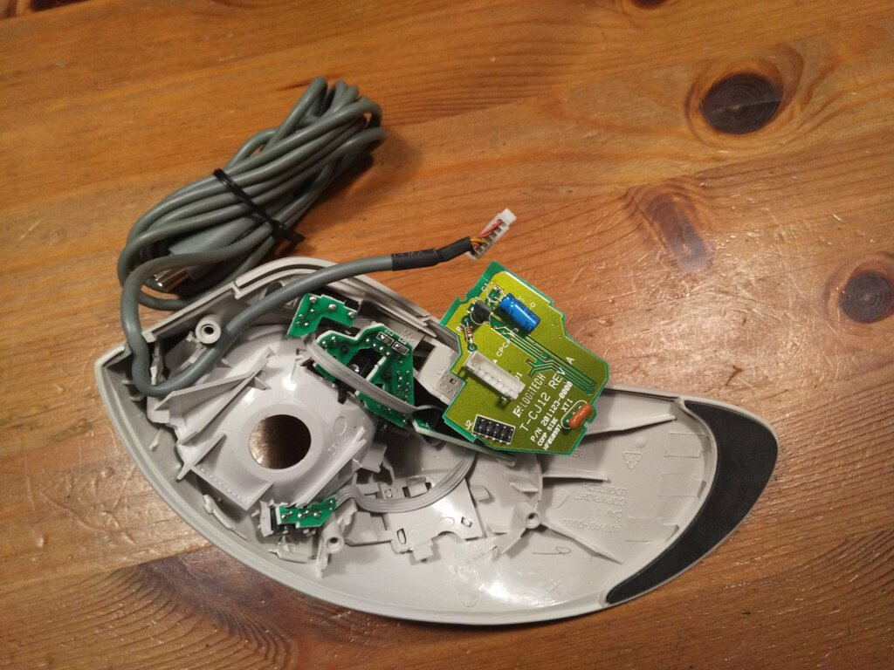
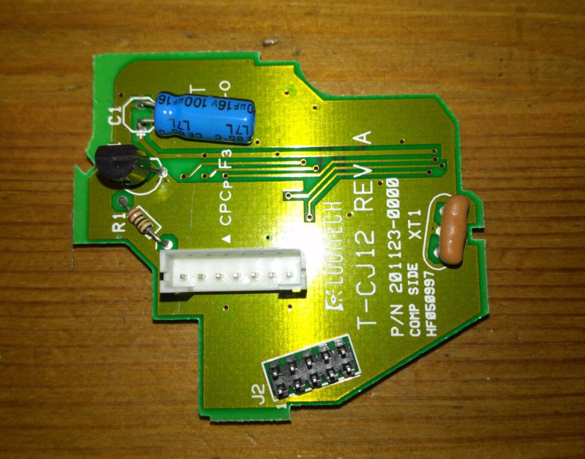
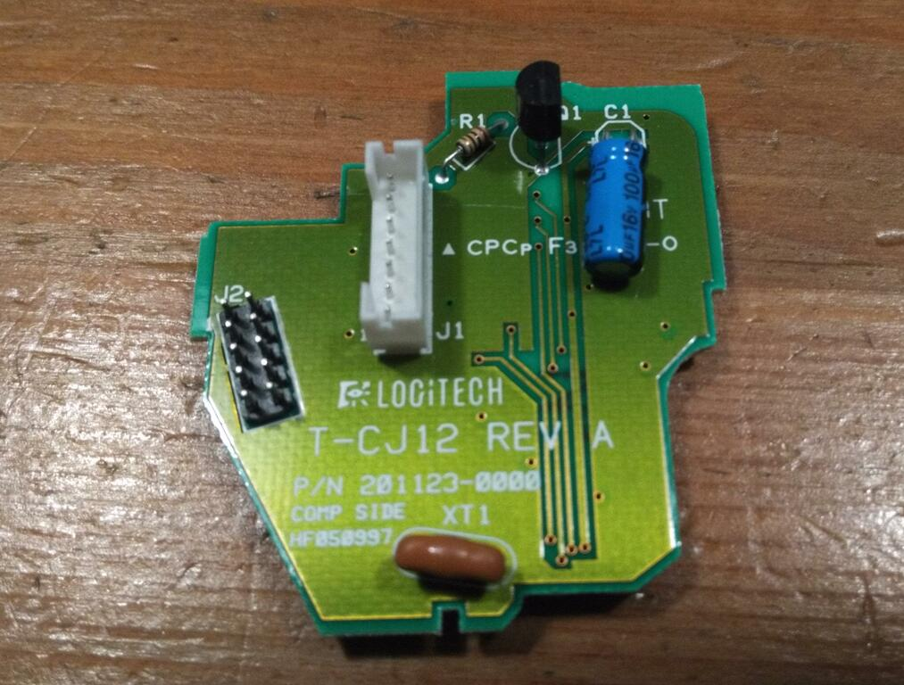
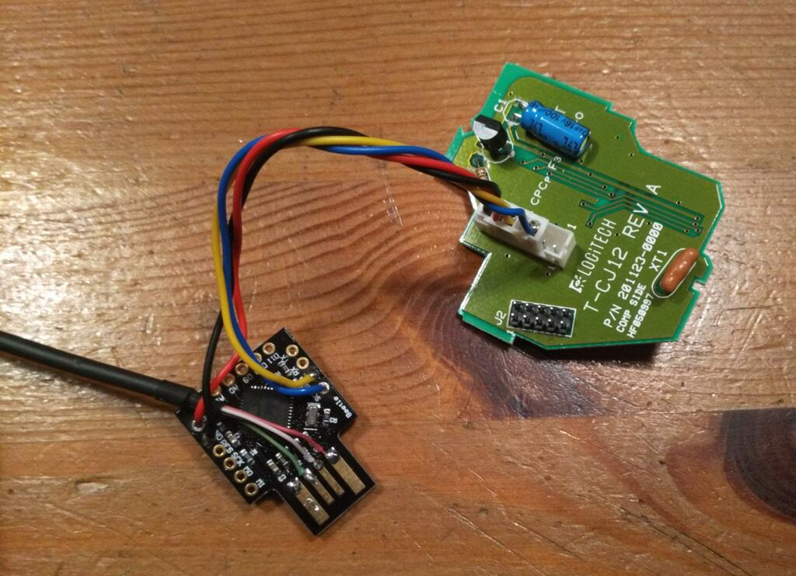

# How I modified my MarbleFX
I used a CJMCU Beetle board, because the integrated USB plug makes it very easy to solder the USB cable due to the large pin spacing.

## This is the MarbleFX before modification:

## The bottom opened and the interface PCB removed:
(beware, there's a screw hidden below the label sticker)

## Close ups of the removed daughter PCB
(you need to solder the pins from the leonardo board to this board)

## Soldered the cables (USB and to the MarbleFX PCB) to the beetle

## Now connect it to the daughter PCB
I used a connector from a Logitech USB mouse cable, so that I did not need to cut the original PS/2 cable. So everything can be returned to the original state.

## This is how the Beetle board fits into the MarbleFX

The Beetle is kept in place by the daughter board.

The additional blue and black cables are RESET and GND, stored below the bottom plate, so that reflashing is easier by triggering a board reset, even if the ACM interface has been patched out of the USB core.
